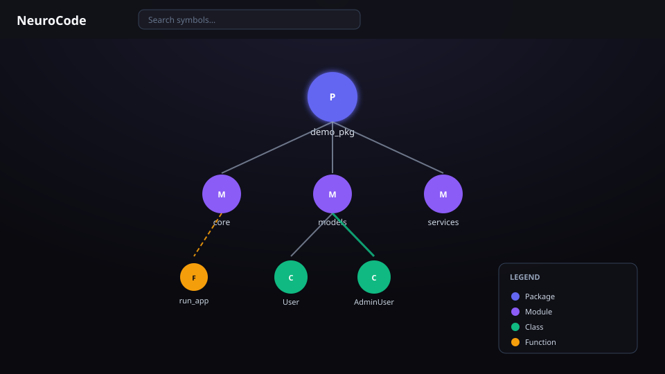

# NeuroCode

**See the architecture of any Python codebase—as a hierarchical knowledge graph you host yourself.**

NeuroCode is for **Python engineers onboarding to a large, unfamiliar codebase**. It parses your project with Tree-sitter, stores structure and relationships in Neo4j, and lets you expand packages → modules → classes → functions in an interactive React explorer—fully local, MIT-licensed.

**One-sentence pitch:** NeuroCode parses your Python project into a Neo4j graph and lets you expand packages, classes, and calls in a hierarchical UI—without sending code to a SaaS.

**One-paragraph pitch:** Joining a legacy monorepo usually means days of reconstructing architecture from imports and tribal knowledge. NeuroCode turns a Python tree into an explorable knowledge graph: hierarchical nodes (packages, classes, functions), relationship edges (contains, imports, calls, inherits), optional file watching, and a dark-mode React UI. You run it yourself with Docker + a short first-run script. Python-first by design; self-hosted by default.



*Illustrative UI of the hierarchical explorer (package → module → class → function). Desktop recommended.*

> **Status:** early `0.1.x` (alpha). Performance numbers in this README are **design goals**, not published benchmarks—see [docs/BENCHMARKS.md](docs/BENCHMARKS.md).

## Python codebase visualization

| Capability | What you get |
|------------|----------------|
| Hierarchical expand | Lazy-load children (not a hairball force graph) |
| Relationship edges | `CONTAINS`, `IMPORTS`, `CALLS`, `INHERITS`, … |
| Local graph DB | Neo4j you own and query |
| Incremental intent | Merkle change detection + file watcher (WebSocket live updates when connected) |
| Search | Full-text node search in the UI |

### How NeuroCode compares

| | NeuroCode | Sourcegraph | CodeLayers | VS Code maps | dependency-cruiser |
|--|-----------|-------------|------------|--------------|--------------------|
| Primary job | Hierarchical code graph | Search + AI intel | 3D spatial deps | In-editor map | Dep rules + SVG |
| Languages | **Python (today)** | Multi | Multi | Multi | JS/TS |
| Hosting | Self-host (Neo4j) | Cloud/self | Cloud + local encrypt | Local IDE | Local CLI |
| Graph DB | Neo4j | Custom | Proprietary | Session | None |
| Open source | MIT | Mixed | Proprietary core | Varies | Yes |

Inspired by the gap left by **Sourcetrail** (discontinued): local, explorable structure—not only text search.

## Quick Start (≤4 steps)

**Requirements:** Docker + Docker Compose, Python 3.11+, Node.js **20+** (for local frontend work). Desktop browser recommended.

```bash
git clone https://github.com/mohitmishra786/neuro-code.git
cd neuro-code
make demo
# open http://localhost:3000
```

`make demo` starts Neo4j + API + frontend via Compose, parses `examples/demo_pkg`, and prints URLs.

### Manual equivalent

```bash
docker compose -f docker/docker-compose.yml up -d
python3 -m venv venv && source venv/bin/activate
pip install -r backend/requirements.txt
export NEO4J_PASSWORD=neurocode_password
python scripts/parse_codebase.py examples/demo_pkg --clear
# Frontend is served by Compose on :3000; API on :8000
```

### Ports & defaults

| Service | URL / port | Default credentials |
|---------|------------|---------------------|
| Frontend | http://localhost:3000 | — |
| API | http://localhost:8000 | no general auth (local only) |
| Neo4j Browser | http://localhost:7474 | `neo4j` / `neurocode_password` |
| Neo4j Bolt | `bolt://localhost:7687` | same |

**Security:** do not expose API/Neo4j to the public internet without auth and a locked parse allowlist. See [SECURITY.md](SECURITY.md).

## Features

- Tree-sitter + AST parsing (4-pass pipeline)
- Neo4j graph with package hierarchy
- React + **ReactFlow** + dagre hierarchical layout
- Dark/light theme, search, breadcrumbs, node detail panel
- Legend for node/edge types; double-click to expand

## Performance goals

These are **targets / design constraints**, not guaranteed measurements. Measured notes: [docs/BENCHMARKS.md](docs/BENCHMARKS.md).

| Metric | Goal |
|--------|------|
| Initial page load | &lt; 2 seconds |
| Node expansion | &lt; 50ms |
| Rendering | 60 FPS (interactive) |
| Parse 1000 files | &lt; 30 seconds |
| Incremental update | &lt; 1 second |
| Scale (design) | up to 100,000 files (lazy load) |

## Technology stack

### Backend (Python 3.11+)
- **Parser:** Tree-sitter + Python AST  
- **Database:** Neo4j 5.x (Docker image `5.26-community` LTS)  
- **API:** FastAPI (REST + WebSocket)  
- **Watching:** watchdog  

### Frontend
- **Framework:** React 18 + TypeScript  
- **Rendering:** ReactFlow + dagre hierarchical layout  
- **State:** Zustand  
- **Build:** Vite  

## Development

```bash
# Backend tests
cd backend && pytest tests/ -v

# Frontend tests
cd frontend && npm run test -- --run

# Lint
cd backend && ruff check .
cd frontend && npm run lint && npm run type-check
```

CI runs on every push/PR via GitHub Actions (`.github/workflows/ci.yml`).

### Local multi-terminal setup (without full Compose frontend)

```bash
docker compose -f docker/docker-compose.yml up neo4j -d
cd backend && python3.11 -m venv ../venv && source ../venv/bin/activate
pip install -r requirements.txt
uvicorn api.main:app --reload --host 0.0.0.0 --port 8000
# other terminal:
cd frontend && npm install && npm run dev
python scripts/parse_codebase.py /path/to/your/python/project
```

## Documentation

- [API Reference](docs/API.md)
- [Architecture Guide](docs/ARCHITECTURE.md)
- [Deployment Guide](docs/DEPLOYMENT.md)
- [UI / design tokens](docs/UI.md)
- [Benchmarks](docs/BENCHMARKS.md)
- [Contributing](CONTRIBUTING.md)
- [Security](SECURITY.md)
- [Launch materials](docs/launch/) (drafts only—not auto-published)
- [llms.txt](llms.txt) for AI agents

## Persona

Primary user: **a mid-level Python engineer dropped into a 50k–500k LOC service** who needs a local architectural map without uploading code to a third party.

## License

MIT License — see [LICENSE](LICENSE).
