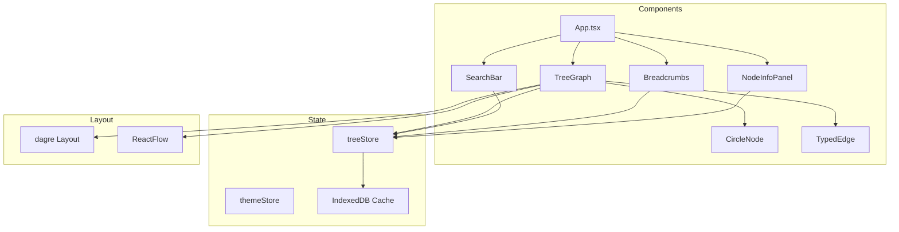

# NeuroCode Architecture

## System Overview

NeuroCode transforms Python codebases into interactive, explorable knowledge graphs with real-time updates and smooth navigation. The visualization uses a hierarchical tree layout with circle nodes that can be incrementally expanded.

```
┌─────────────────────────────────────────────────────────────────┐
│                         Frontend (React)                         │
│  ┌──────────┐  ┌──────────┐  ┌──────────┐  ┌──────────────────┐ │
│  │TreeGraph │  │ TreeStore│  │  Search  │  │    WebSocket     │ │
│  │(ReactFlow│  │ (Zustand)│  │  Panel   │  │    Handler       │ │
│  │ + dagre) │  │          │  │          │  │                  │ │
│  └────┬─────┘  └────┬─────┘  └────┬─────┘  └────────┬─────────┘ │
└───────┼─────────────┼─────────────┼─────────────────┼───────────┘
        │             │             │                 │
        └─────────────┴─────────────┴─────────────────┘
                              │
                    REST API + WebSocket
                              │
┌─────────────────────────────┼───────────────────────────────────┐
│                         Backend (FastAPI)                        │
│  ┌──────────┐  ┌──────────┐  │  ┌──────────┐  ┌──────────────┐  │
│  │  Graph   │  │  Search  │  │  │ WebSocket│  │    File      │  │
│  │  Routes  │  │  Routes  │  │  │  Handler │  │   Watcher    │  │
│  └────┬─────┘  └────┬─────┘  │  └────┬─────┘  └──────┬───────┘  │
└───────┼─────────────┼────────┼───────┼───────────────┼──────────┘
        │             │        │       │               │
        └─────────────┴────────┴───────┘               │
                      │                                │
┌─────────────────────┼────────────────────────────────┼──────────┐
│                     │      Core Services             │          │
│  ┌──────────────────┴──────────┐  ┌──────────────────┴───────┐  │
│  │         Neo4j Client        │  │    ProjectParser         │  │
│  │   (Graph + Package Nodes)   │  │  (Packages + Modules)    │  │
│  └──────────────┬──────────────┘  └──────────────────────────┘  │
└─────────────────┼───────────────────────────────────────────────┘
                  │
         ┌────────┴────────┐
         │     Neo4j       │
         │    Database     │
         └─────────────────┘
```

---

## Frontend Architecture



### Node Types

The visualization represents Python code elements as colored circle nodes:

| Node Type | Color | Icon | Description |
|-----------|-------|------|-------------|
| Package | Indigo (#6366f1) | P | Directory with `__init__.py` |
| Module | Purple (#8b5cf6) | M | Python file |
| Class | Emerald (#10b981) | C | Class definition |
| Function | Amber (#f59e0b) | F | Function or method |
| Variable | Pink (#ec4899) | V | Module/class variable |

### Edge Types

Relationships between nodes are shown as directed edges:

| Edge Type | Style | Color | Description |
|-----------|-------|-------|-------------|
| CONTAINS | Solid | Gray | Hierarchy (package→module→class→function) |
| CALLS | Dashed + Animated | Amber | Function calls |
| IMPORTS | Dotted | Indigo | Import relationships |
| INHERITS | Thick solid | Emerald | Class inheritance |

---

## Data Flow

### Initial Load
1. User opens application
2. Frontend requests root nodes via `GET /graph/root`
3. Backend queries Neo4j for top-level packages and orphan modules
4. Frontend renders nodes with ReactFlow + dagre layout
5. IndexedDB caches the results

### Node Expansion (Lazy Loading)
1. User double-clicks a node with children
2. TreeStore checks IndexedDB cache first
3. If cache miss, requests children via `GET /graph/expand/{id}`
4. Backend returns children + outgoing relationships
5. Dagre recalculates layout for new nodes
6. Frontend animates new nodes into view
7. Results cached in IndexedDB

### File Change (Real-time Updates)
1. File watcher detects change
2. Debouncer accumulates changes (500ms)
3. ProjectParser re-parses changed files
4. Merkle tree identifies modified nodes
5. Neo4j updated with delta changes
6. WebSocket broadcasts update to clients
7. Frontend clears cache and reloads affected nodes

---

## Backend Components

### Parser Layer (4-Pass Architecture)
- **Pass 0 (Packages)**: Discovers directories with `__init__.py`
- **Pass 1 (Discovery)**: Maps files to module IDs
- **Pass 2 (Local AST)**: Extracts definitions and references
- **Pass 3 (Linker)**: Resolves cross-file relationships

### Node Hierarchy
```
Package
  ├── Package (sub-package)
  │   ├── Module
  │   │   ├── Class
  │   │   │   ├── Method (Function)
  │   │   │   └── Variable
  │   │   ├── Function
  │   │   └── Variable
  │   └── ...
  └── Module
      └── ...
```

### Graph Engine
- **Neo4jClient**: Async client with connection pooling
  - `create_package()`: Creates Package nodes
  - `get_children_paginated()`: Paginated child retrieval
  - `get_nodes_at_depth()`: Depth-limited queries
  - `expand_node()`: Returns children + outgoing edges
- **GraphSchema**: Node/relationship definitions (now includes Package)
- **QueryLibrary**: Optimized Cypher queries

### API Endpoints

| Endpoint | Method | Description |
|----------|--------|-------------|
| `/graph/root` | GET | Get root packages/modules |
| `/graph/expand/{id}` | GET | Expand node with children |
| `/graph/node/{id}/children/paginated` | GET | Paginated children |
| `/search` | GET | Full-text search |
| `/ws` | WebSocket | Real-time updates |

---

## State Management

### TreeStore (Zustand)

```typescript
interface TreeState {
    nodes: Node[];           // ReactFlow nodes
    edges: Edge[];           // ReactFlow edges
    nodeCache: Map<string, TreeNode>;  // Fetched nodes
    expandedIds: Set<string>;          // Expanded node IDs
    selectedNodeId: string | null;
    breadcrumbPath: TreeNode[];
    isLoading: boolean;
    isExpanding: Set<string>;  // Currently expanding
}
```

### Actions
- `loadRootNodes()`: Fetch and display root packages
- `expandNode(id)`: Lazy-load children
- `collapseNode(id)`: Remove children from view
- `selectNode(id)`: Update selection and breadcrumbs
- `focusNode(id)`: Navigate to node, expanding path

---

## Performance Targets

| Metric | Target | Implementation |
|--------|--------|----------------|
| Initial load | < 2s | Load only root packages |
| Node expansion | < 50ms | Single API call + cached layout |
| Full parse 1000 files | < 30s | Tree-sitter + 4-pass parser |
| Render 1000+ nodes | 60 FPS | ReactFlow virtualization |
| Max codebase | 100k files | Lazy loading + pagination |
| Search results | < 200ms | Neo4j full-text index |

---

## CLI Options

```bash
# Basic parsing
python scripts/parse_deep.py /path/to/project

# With options
python scripts/parse_codebase.py /path/to/project \
    --clear              # Clear existing data
    --max-depth 3        # Limit parse depth
    --include-variables  # Include variables
    --exclude-tests      # Skip test files
```
